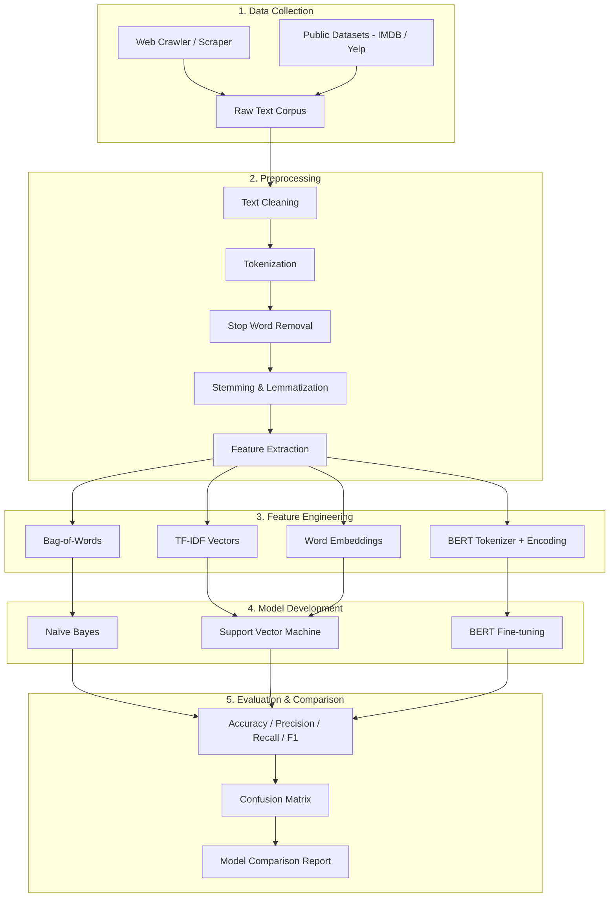
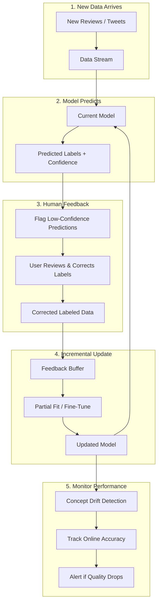

# Sentiment Analysis with NLP

## Project Overview

A Natural Language Processing (NLP) project focused on **Sentiment Analysis** — determining whether a piece of text (e.g., tweets, product reviews, forum posts) carries a **positive**, **negative**, or **neutral** sentiment. The project covers the full NLP pipeline: data collection via web crawling, text preprocessing, feature extraction, model development with multiple approaches, and comparative evaluation.

### Key Characteristics
- **NLP Task**: Sentiment Analysis (Text Classification)
- **Data Source**: Web-crawled reviews/posts from forums and social media, supplemented by established datasets
- **Methods**: Naïve Bayes, Support Vector Machine (SVM), Transformer-based models (BERT)
- **Language**: Python
- **Evaluation**: Accuracy, Precision, Recall, F1 Score
- **Timeline**: 9–10 weeks (Week 3 → Week 12)

---

## Background Study

### 2.1 The Chosen NLP Problem

**Sentiment Analysis** (also known as opinion mining) is a sub-field of NLP that aims to identify and extract subjective information from text. Given a document or sentence, the task is to classify it as expressing a **positive**, **negative**, or **neutral** opinion.

This project frames sentiment analysis as a **text classification** problem where:
- **Input**: A natural-language text (review, tweet, comment)
- **Output**: A sentiment label (`positive`, `negative`, or `neutral`)

### 2.2 Significance and Real-World Applications

Sentiment analysis is one of the most commercially impactful NLP tasks:

| Domain | Application |
|--------|-------------|
| **Business & Marketing** | Monitor brand perception, track product feedback, gauge campaign effectiveness |
| **Customer Service** | Automatically prioritize negative reviews, route unhappy customers to support |
| **Finance** | Analyze market sentiment from news and social media to inform trading decisions |
| **Healthcare** | Assess patient feedback, monitor public health sentiment during epidemics |
| **Politics** | Track public opinion on policies, predict election outcomes from social media |
| **E-Commerce** | Aggregate product ratings, summarize review themes, detect fake reviews |

### 2.3 Common Methods and Techniques

#### Traditional / Statistical Methods
| Method | Description |
|--------|-------------|
| **Bag-of-Words (BoW)** | Represents text as a vector of word counts, ignoring grammar and word order |
| **TF-IDF** | Weighs terms by their frequency in a document relative to the entire corpus, reducing the impact of common words |
| **Naïve Bayes** | Probabilistic classifier based on Bayes' theorem; works well with BoW/TF-IDF features |
| **Support Vector Machine (SVM)** | Finds optimal hyperplane to separate classes; effective for high-dimensional text data |
| **Logistic Regression** | Linear classifier that outputs probabilities; strong baseline for text classification |

#### Deep Learning / Neural Methods
| Method | Description |
|--------|-------------|
| **Word Embeddings (Word2Vec, GloVe)** | Dense vector representations that capture semantic relationships between words |
| **LSTM / BiLSTM** | Recurrent networks that model sequential dependencies in text |
| **BERT (Bidirectional Encoder Representations from Transformers)** | Pre-trained transformer model that captures deep contextual word meanings; state-of-the-art for many NLP tasks |
| **DistilBERT** | Smaller, faster version of BERT that retains ~97% of performance |

### 2.4 Reference Resources
- [Sentiment Analysis Resource (UIC)](https://www.cs.uic.edu/~liub/FBS/sentiment-analysis.html)
- [Twitter Analytics Tutorial](http://adilmoujahid.com/posts/2014/07/twitter-analytics/)
- [Yelp Dataset](https://www.yelp.com/dataset)
- [Stanford Large Movie Review Dataset (IMDB)](https://ai.stanford.edu/~amaas/data/sentiment/)

---

## NLP Architecture

### Architecture Diagram



---

## Core Components

### 1. Web Crawler — Data Collection

A web crawler/scraper to collect sample data from forums, social media, or review sites.

#### 1.1 General-Purpose Review Scraper
```python
import requests
from bs4 import BeautifulSoup
import csv
import time
import random

class ReviewCrawler:
    """Web crawler to collect review data from forums/review sites."""

    def __init__(self, base_url: str, output_file: str = 'crawled_reviews.csv'):
        self.base_url = base_url
        self.output_file = output_file
        self.headers = {
            'User-Agent': 'Mozilla/5.0 (compatible; SentimentBot/1.0; +research)'
        }
        self.reviews = []

    def crawl_page(self, url: str) -> list[dict]:
        """Fetch and parse a single page for review content."""
        try:
            response = requests.get(url, headers=self.headers, timeout=10)
            response.raise_for_status()
            soup = BeautifulSoup(response.text, 'html.parser')

            page_reviews = []
            # Adapt selectors to target site
            review_elements = soup.find_all('div', class_='review')
            for elem in review_elements:
                text = elem.get_text(strip=True)
                rating = elem.find('span', class_='rating')
                page_reviews.append({
                    'text': text,
                    'rating': rating.get_text(strip=True) if rating else None,
                    'source_url': url
                })

            return page_reviews

        except requests.RequestException as e:
            print(f"Error crawling {url}: {e}")
            return []

    def crawl_multiple_pages(self, urls: list[str], delay: float = 2.0):
        """Crawl multiple pages with polite delays."""
        for url in urls:
            reviews = self.crawl_page(url)
            self.reviews.extend(reviews)
            print(f"Collected {len(reviews)} reviews from {url}")
            time.sleep(delay + random.uniform(0, 1))  # Polite crawling

    def save_to_csv(self):
        """Save crawled reviews to CSV."""
        with open(self.output_file, 'w', newline='', encoding='utf-8') as f:
            writer = csv.DictWriter(f, fieldnames=['text', 'rating', 'source_url'])
            writer.writeheader()
            writer.writerows(self.reviews)
        print(f"Saved {len(self.reviews)} reviews to {self.output_file}")
```

#### 1.2 Dataset Loader (For Reliable Datasets)
```python
import pandas as pd
import os
import tarfile
import urllib.request

class DatasetLoader:
    """Load sentiment datasets from reliable sources."""

    @staticmethod
    def load_imdb(data_dir: str = 'data/imdb') -> pd.DataFrame:
        """Load Stanford IMDB Large Movie Review Dataset."""
        url = 'https://ai.stanford.edu/~amaas/data/sentiment/aclImdb_v1.tar.gz'

        if not os.path.exists(data_dir):
            print("Downloading IMDB dataset...")
            filepath, _ = urllib.request.urlretrieve(url, 'aclImdb_v1.tar.gz')
            with tarfile.open(filepath, 'r:gz') as tar:
                tar.extractall(data_dir)

        reviews, sentiments = [], []
        for sentiment in ['pos', 'neg']:
            folder = os.path.join(data_dir, 'aclImdb', 'train', sentiment)
            for filename in os.listdir(folder):
                with open(os.path.join(folder, filename), 'r', encoding='utf-8') as f:
                    reviews.append(f.read())
                    sentiments.append(1 if sentiment == 'pos' else 0)

        return pd.DataFrame({'text': reviews, 'label': sentiments})

    @staticmethod
    def load_csv_dataset(filepath: str) -> pd.DataFrame:
        """Load a CSV dataset (crawled or downloaded)."""
        df = pd.read_csv(filepath)
        print(f"Loaded {len(df)} samples from {filepath}")
        return df
```

---

### 2. Data Preprocessing

Preprocess raw text to make it suitable for analysis.

#### 2.1 Text Cleaning
```python
import re
import string

class TextCleaner:
    """Clean raw text: remove noise, special characters, HTML tags."""

    @staticmethod
    def clean(text: str) -> str:
        # Remove HTML tags
        text = re.sub(r'<[^>]+>', '', text)
        # Remove URLs
        text = re.sub(r'http\S+|www\.\S+', '', text)
        # Remove mentions and hashtags
        text = re.sub(r'@\w+|#\w+', '', text)
        # Remove special characters and numbers
        text = re.sub(r'[^a-zA-Z\s]', '', text)
        # Remove extra whitespace
        text = re.sub(r'\s+', ' ', text).strip()
        # Lowercase
        text = text.lower()
        return text
```

#### 2.2 Tokenization, Stemming, and Lemmatization
```python
import nltk
from nltk.tokenize import word_tokenize
from nltk.stem import PorterStemmer, WordNetLemmatizer
from nltk.corpus import stopwords

nltk.download('punkt')
nltk.download('stopwords')
nltk.download('wordnet')

class TextTokenizer:
    """Tokenize text and apply stemming/lemmatization."""

    def __init__(self):
        self.stemmer = PorterStemmer()
        self.lemmatizer = WordNetLemmatizer()
        self.stop_words = set(stopwords.words('english'))

    def tokenize(self, text: str) -> list[str]:
        """Tokenize text into words."""
        return word_tokenize(text)

    def remove_stopwords(self, tokens: list[str]) -> list[str]:
        """Remove stop words."""
        return [t for t in tokens if t not in self.stop_words]

    def stem(self, tokens: list[str]) -> list[str]:
        """Apply Porter Stemming."""
        return [self.stemmer.stem(t) for t in tokens]

    def lemmatize(self, tokens: list[str]) -> list[str]:
        """Apply WordNet Lemmatization."""
        return [self.lemmatizer.lemmatize(t) for t in tokens]

    def preprocess(self, text: str, use_lemma: bool = True) -> list[str]:
        """Full preprocessing pipeline."""
        tokens = self.tokenize(text)
        tokens = self.remove_stopwords(tokens)
        if use_lemma:
            tokens = self.lemmatize(tokens)
        else:
            tokens = self.stem(tokens)
        return tokens
```

#### 2.3 Feature Extraction
```python
from sklearn.feature_extraction.text import CountVectorizer, TfidfVectorizer
from gensim.models import Word2Vec
import numpy as np

class FeatureExtractor:
    """Extract features from preprocessed text."""

    def __init__(self):
        self.bow_vectorizer = CountVectorizer(max_features=5000)
        self.tfidf_vectorizer = TfidfVectorizer(max_features=5000)

    def extract_bow(self, corpus: list[str]):
        """Bag-of-Words feature extraction."""
        return self.bow_vectorizer.fit_transform(corpus)

    def extract_tfidf(self, corpus: list[str]):
        """TF-IDF feature extraction."""
        return self.tfidf_vectorizer.fit_transform(corpus)

    @staticmethod
    def extract_word2vec(tokenized_corpus: list[list[str]],
                         vector_size: int = 100,
                         window: int = 5) -> tuple:
        """Word2Vec embeddings — returns model and document vectors."""
        model = Word2Vec(
            sentences=tokenized_corpus,
            vector_size=vector_size,
            window=window,
            min_count=2,
            workers=4
        )

        # Average word vectors to create document vectors
        doc_vectors = []
        for tokens in tokenized_corpus:
            vectors = [model.wv[t] for t in tokens if t in model.wv]
            if vectors:
                doc_vectors.append(np.mean(vectors, axis=0))
            else:
                doc_vectors.append(np.zeros(vector_size))

        return model, np.array(doc_vectors)
```

---

### 3. Model Development

Each team member implements a different sentiment analysis model.

#### 3.1 Model A — Naïve Bayes Classifier
```python
from sklearn.naive_bayes import MultinomialNB
from sklearn.model_selection import train_test_split
from sklearn.metrics import (accuracy_score, precision_score,
                             recall_score, f1_score,
                             classification_report, confusion_matrix)

class NaiveBayesModel:
    """Sentiment classifier using Multinomial Naïve Bayes with TF-IDF."""

    def __init__(self):
        self.vectorizer = TfidfVectorizer(max_features=10000)
        self.model = MultinomialNB(alpha=1.0)

    def train(self, texts: list[str], labels: list[int], test_size: float = 0.2):
        """Train the Naïve Bayes model."""
        # Feature extraction
        X = self.vectorizer.fit_transform(texts)
        y = np.array(labels)

        # Train-test split
        X_train, X_test, y_train, y_test = train_test_split(
            X, y, test_size=test_size, random_state=42, stratify=y
        )

        # Train model
        self.model.fit(X_train, y_train)

        # Evaluate
        y_pred = self.model.predict(X_test)
        return self._evaluate(y_test, y_pred)

    def predict(self, texts: list[str]) -> list[int]:
        """Predict sentiment for new texts."""
        X = self.vectorizer.transform(texts)
        return self.model.predict(X).tolist()

    @staticmethod
    def _evaluate(y_true, y_pred) -> dict:
        return {
            'accuracy': accuracy_score(y_true, y_pred),
            'precision': precision_score(y_true, y_pred, average='weighted'),
            'recall': recall_score(y_true, y_pred, average='weighted'),
            'f1_score': f1_score(y_true, y_pred, average='weighted'),
            'report': classification_report(y_true, y_pred),
            'confusion_matrix': confusion_matrix(y_true, y_pred)
        }
```

#### 3.2 Model B — Support Vector Machine (SVM)
```python
from sklearn.svm import SVC
from sklearn.pipeline import Pipeline
from sklearn.model_selection import GridSearchCV

class SVMModel:
    """Sentiment classifier using SVM with TF-IDF features."""

    def __init__(self):
        self.pipeline = Pipeline([
            ('tfidf', TfidfVectorizer(max_features=10000, ngram_range=(1, 2))),
            ('svm', SVC(kernel='linear', C=1.0, probability=True))
        ])

    def train(self, texts: list[str], labels: list[int], test_size: float = 0.2):
        """Train the SVM model."""
        X_train, X_test, y_train, y_test = train_test_split(
            texts, labels, test_size=test_size, random_state=42, stratify=labels
        )

        self.pipeline.fit(X_train, y_train)
        y_pred = self.pipeline.predict(X_test)
        return self._evaluate(y_test, y_pred)

    def train_with_tuning(self, texts: list[str], labels: list[int]):
        """Train with hyperparameter tuning via Grid Search."""
        param_grid = {
            'tfidf__max_features': [5000, 10000],
            'tfidf__ngram_range': [(1, 1), (1, 2)],
            'svm__C': [0.1, 1.0, 10.0],
            'svm__kernel': ['linear', 'rbf']
        }

        grid_search = GridSearchCV(
            self.pipeline, param_grid, cv=5, scoring='f1_weighted', n_jobs=-1
        )
        grid_search.fit(texts, labels)

        self.pipeline = grid_search.best_estimator_
        print(f"Best params: {grid_search.best_params_}")
        return grid_search.best_score_

    def predict(self, texts: list[str]) -> list[int]:
        return self.pipeline.predict(texts).tolist()

    @staticmethod
    def _evaluate(y_true, y_pred) -> dict:
        return {
            'accuracy': accuracy_score(y_true, y_pred),
            'precision': precision_score(y_true, y_pred, average='weighted'),
            'recall': recall_score(y_true, y_pred, average='weighted'),
            'f1_score': f1_score(y_true, y_pred, average='weighted'),
            'report': classification_report(y_true, y_pred),
            'confusion_matrix': confusion_matrix(y_true, y_pred)
        }
```

#### 3.3 Model C — BERT (Transformer-based)
```python
import torch
from torch.utils.data import Dataset, DataLoader
from transformers import (BertTokenizer, BertForSequenceClassification,
                          AdamW, get_linear_schedule_with_warmup)

class SentimentDataset(Dataset):
    """PyTorch dataset for sentiment text data."""

    def __init__(self, texts, labels, tokenizer, max_len=128):
        self.texts = texts
        self.labels = labels
        self.tokenizer = tokenizer
        self.max_len = max_len

    def __len__(self):
        return len(self.texts)

    def __getitem__(self, idx):
        encoding = self.tokenizer(
            self.texts[idx],
            max_length=self.max_len,
            padding='max_length',
            truncation=True,
            return_tensors='pt'
        )
        return {
            'input_ids': encoding['input_ids'].squeeze(),
            'attention_mask': encoding['attention_mask'].squeeze(),
            'label': torch.tensor(self.labels[idx], dtype=torch.long)
        }


class BERTSentimentModel:
    """Sentiment classifier using fine-tuned BERT."""

    def __init__(self, num_labels: int = 2, model_name: str = 'bert-base-uncased'):
        self.tokenizer = BertTokenizer.from_pretrained(model_name)
        self.model = BertForSequenceClassification.from_pretrained(
            model_name, num_labels=num_labels
        )
        self.device = torch.device('cuda' if torch.cuda.is_available() else 'cpu')
        self.model.to(self.device)

    def train(self, texts, labels, epochs: int = 3, batch_size: int = 16,
              learning_rate: float = 2e-5, test_size: float = 0.2):
        """Fine-tune BERT on sentiment data."""
        # Split data
        X_train, X_test, y_train, y_test = train_test_split(
            texts, labels, test_size=test_size, random_state=42, stratify=labels
        )

        # Create data loaders
        train_dataset = SentimentDataset(X_train, y_train, self.tokenizer)
        test_dataset = SentimentDataset(X_test, y_test, self.tokenizer)
        train_loader = DataLoader(train_dataset, batch_size=batch_size, shuffle=True)
        test_loader = DataLoader(test_dataset, batch_size=batch_size)

        # Optimizer and scheduler
        optimizer = AdamW(self.model.parameters(), lr=learning_rate)
        total_steps = len(train_loader) * epochs
        scheduler = get_linear_schedule_with_warmup(
            optimizer, num_warmup_steps=0, num_training_steps=total_steps
        )

        # Training loop
        self.model.train()
        for epoch in range(epochs):
            total_loss = 0
            for batch in train_loader:
                input_ids = batch['input_ids'].to(self.device)
                attention_mask = batch['attention_mask'].to(self.device)
                labels_batch = batch['label'].to(self.device)

                outputs = self.model(
                    input_ids=input_ids,
                    attention_mask=attention_mask,
                    labels=labels_batch
                )

                loss = outputs.loss
                total_loss += loss.item()

                loss.backward()
                torch.nn.utils.clip_grad_norm_(self.model.parameters(), 1.0)
                optimizer.step()
                scheduler.step()
                optimizer.zero_grad()

            avg_loss = total_loss / len(train_loader)
            print(f"Epoch {epoch + 1}/{epochs} — Loss: {avg_loss:.4f}")

        # Evaluate
        return self._evaluate(test_loader)

    def _evaluate(self, test_loader) -> dict:
        """Evaluate model on test data."""
        self.model.eval()
        all_preds, all_labels = [], []

        with torch.no_grad():
            for batch in test_loader:
                input_ids = batch['input_ids'].to(self.device)
                attention_mask = batch['attention_mask'].to(self.device)
                labels_batch = batch['label'].to(self.device)

                outputs = self.model(input_ids=input_ids, attention_mask=attention_mask)
                preds = torch.argmax(outputs.logits, dim=1)

                all_preds.extend(preds.cpu().numpy())
                all_labels.extend(labels_batch.cpu().numpy())

        return {
            'accuracy': accuracy_score(all_labels, all_preds),
            'precision': precision_score(all_labels, all_preds, average='weighted'),
            'recall': recall_score(all_labels, all_preds, average='weighted'),
            'f1_score': f1_score(all_labels, all_preds, average='weighted'),
            'report': classification_report(all_labels, all_preds),
            'confusion_matrix': confusion_matrix(all_labels, all_preds)
        }

    def predict(self, texts: list[str]) -> list[int]:
        """Predict sentiment for new texts."""
        self.model.eval()
        predictions = []
        for text in texts:
            encoding = self.tokenizer(
                text, max_length=128, padding='max_length',
                truncation=True, return_tensors='pt'
            )
            input_ids = encoding['input_ids'].to(self.device)
            attention_mask = encoding['attention_mask'].to(self.device)

            with torch.no_grad():
                outputs = self.model(input_ids=input_ids, attention_mask=attention_mask)
                pred = torch.argmax(outputs.logits, dim=1).item()
                predictions.append(pred)

        return predictions
```

---

### 4. Model Comparison & Evaluation

Compare all models using consistent evaluation metrics.

#### 4.1 Evaluation Metrics
```python
import matplotlib.pyplot as plt
import seaborn as sns
from sklearn.metrics import ConfusionMatrixDisplay

class ModelEvaluator:
    """Compare and evaluate multiple sentiment models."""

    def __init__(self):
        self.results = {}

    def add_result(self, model_name: str, metrics: dict):
        """Store evaluation results for a model."""
        self.results[model_name] = metrics

    def comparison_table(self) -> pd.DataFrame:
        """Generate a comparison table of all models."""
        rows = []
        for name, metrics in self.results.items():
            rows.append({
                'Model': name,
                'Accuracy': f"{metrics['accuracy']:.4f}",
                'Precision': f"{metrics['precision']:.4f}",
                'Recall': f"{metrics['recall']:.4f}",
                'F1 Score': f"{metrics['f1_score']:.4f}"
            })
        return pd.DataFrame(rows)

    def plot_comparison(self, save_path: str = 'model_comparison.png'):
        """Bar chart comparing model performance."""
        df = self.comparison_table()
        metrics = ['Accuracy', 'Precision', 'Recall', 'F1 Score']

        fig, ax = plt.subplots(figsize=(10, 6))
        x = range(len(df))
        width = 0.2

        for i, metric in enumerate(metrics):
            values = [float(v) for v in df[metric]]
            ax.bar([xi + i * width for xi in x], values, width, label=metric)

        ax.set_xlabel('Model')
        ax.set_ylabel('Score')
        ax.set_title('Sentiment Analysis — Model Comparison')
        ax.set_xticks([xi + 1.5 * width for xi in x])
        ax.set_xticklabels(df['Model'])
        ax.legend()
        ax.set_ylim(0, 1.0)
        plt.tight_layout()
        plt.savefig(save_path, dpi=150)
        plt.show()

    def plot_confusion_matrices(self, save_path: str = 'confusion_matrices.png'):
        """Plot confusion matrix for each model side-by-side."""
        n = len(self.results)
        fig, axes = plt.subplots(1, n, figsize=(6 * n, 5))
        if n == 1:
            axes = [axes]

        for ax, (name, metrics) in zip(axes, self.results.items()):
            ConfusionMatrixDisplay(
                confusion_matrix=metrics['confusion_matrix'],
                display_labels=['Negative', 'Positive']
            ).plot(ax=ax, cmap='Blues')
            ax.set_title(f'{name}')

        plt.tight_layout()
        plt.savefig(save_path, dpi=150)
        plt.show()
```

---

### 5. Online Learning & Human Feedback Loop (Recursive Learning)

The models above are trained once on a fixed dataset. **Online Learning** (also called **Incremental Learning**) allows the model to **continuously improve** as new data arrives and users provide feedback — without retraining from scratch each time.

#### 5.1 Concept Overview

| Concept | Description |
|---------|-------------|
| **Online Learning** | Model updates incrementally with each new batch of data, rather than retraining on the entire dataset |
| **Human-in-the-Loop (HITL)** | Users review model predictions, correct mistakes, and those corrections become new training data |
| **Active Learning** | Model identifies its most uncertain predictions and prioritizes those for human review |
| **Continual Learning** | Learning new patterns while preserving previously learned knowledge (avoiding "catastrophic forgetting") |

#### 5.2 Feedback Loop Architecture



#### 5.3 Online Learner (Incremental Model Updates)
```python
from sklearn.naive_bayes import MultinomialNB
from sklearn.linear_model import SGDClassifier
from sklearn.feature_extraction.text import HashingVectorizer
import numpy as np
import joblib
from datetime import datetime

class OnlineLearner:
    """Wraps a model for incremental/online learning with partial_fit support."""

    def __init__(self, model_type: str = 'nb', n_features: int = 2**16):
        # HashingVectorizer is stateless — works for online learning
        self.vectorizer = HashingVectorizer(
            n_features=n_features,
            alternate_sign=False,
            ngram_range=(1, 2)
        )

        if model_type == 'nb':
            self.model = MultinomialNB(alpha=1.0)
        elif model_type == 'sgd':
            # SGDClassifier with log_loss = online logistic regression
            self.model = SGDClassifier(
                loss='log_loss',
                penalty='l2',
                alpha=1e-4,
                random_state=42
            )
        else:
            raise ValueError(f"Unsupported model type: {model_type}")

        self.classes = np.array([0, 1])  # negative, positive
        self.is_fitted = False
        self.update_count = 0
        self.training_history = []

    def initial_train(self, texts: list[str], labels: list[int]):
        """Initial training on existing dataset."""
        X = self.vectorizer.transform(texts)
        self.model.partial_fit(X, labels, classes=self.classes)
        self.is_fitted = True
        self.update_count += 1
        self._log_update(len(texts), 'initial_train')

    def incremental_update(self, new_texts: list[str], new_labels: list[int]):
        """Update model with new labeled data (from user feedback)."""
        if not self.is_fitted:
            return self.initial_train(new_texts, new_labels)

        X = self.vectorizer.transform(new_texts)
        self.model.partial_fit(X, new_labels)
        self.update_count += 1
        self._log_update(len(new_texts), 'incremental_update')

    def predict(self, texts: list[str]) -> list[int]:
        """Predict sentiment labels."""
        X = self.vectorizer.transform(texts)
        return self.model.predict(X).tolist()

    def predict_with_confidence(self, texts: list[str]) -> list[dict]:
        """Predict with confidence scores — used for active learning."""
        X = self.vectorizer.transform(texts)

        if hasattr(self.model, 'predict_proba'):
            probs = self.model.predict_proba(X)
        else:
            # SGDClassifier with log_loss supports predict_proba
            probs = self.model.predict_proba(X)

        results = []
        for i, text in enumerate(texts):
            pred = int(np.argmax(probs[i]))
            conf = float(np.max(probs[i]))
            results.append({
                'text': text,
                'prediction': pred,
                'confidence': conf,
                'label': 'positive' if pred == 1 else 'negative'
            })
        return results

    def save_model(self, filepath: str = 'online_model.pkl'):
        """Save model checkpoint."""
        joblib.dump({
            'model': self.model,
            'update_count': self.update_count,
            'history': self.training_history
        }, filepath)

    def load_model(self, filepath: str = 'online_model.pkl'):
        """Load model checkpoint."""
        data = joblib.load(filepath)
        self.model = data['model']
        self.update_count = data['update_count']
        self.training_history = data['history']
        self.is_fitted = True

    def _log_update(self, n_samples: int, update_type: str):
        self.training_history.append({
            'timestamp': datetime.now().isoformat(),
            'type': update_type,
            'n_samples': n_samples,
            'total_updates': self.update_count
        })
```

#### 5.4 Feedback Collector (Human-in-the-Loop)
```python
import json
from pathlib import Path

class FeedbackCollector:
    """Collect and store user feedback on model predictions."""

    def __init__(self, feedback_file: str = 'data/feedback.jsonl'):
        self.feedback_file = Path(feedback_file)
        self.feedback_buffer = []  # Pending feedback for next update
        self.confidence_threshold = 0.7  # Flag predictions below this

    def flag_uncertain_predictions(self, predictions: list[dict]) -> list[dict]:
        """Identify predictions the model is uncertain about (for active learning)."""
        uncertain = [
            p for p in predictions
            if p['confidence'] < self.confidence_threshold
        ]
        print(f"Flagged {len(uncertain)}/{len(predictions)} predictions for review "
              f"(confidence < {self.confidence_threshold})")
        return uncertain

    def collect_feedback(self, text: str, predicted_label: int,
                         correct_label: int, user_id: str = 'anonymous'):
        """Record a single piece of user feedback."""
        feedback = {
            'text': text,
            'predicted': predicted_label,
            'corrected': correct_label,
            'was_correct': predicted_label == correct_label,
            'user_id': user_id,
            'timestamp': datetime.now().isoformat()
        }
        self.feedback_buffer.append(feedback)
        self._save_feedback(feedback)
        return feedback

    def get_pending_feedback(self, min_batch_size: int = 10) -> tuple:
        """Get buffered feedback ready for model update."""
        if len(self.feedback_buffer) < min_batch_size:
            print(f"Only {len(self.feedback_buffer)} feedback items "
                  f"(need {min_batch_size} for update)")
            return [], []

        texts = [f['text'] for f in self.feedback_buffer]
        labels = [f['corrected'] for f in self.feedback_buffer]
        self.feedback_buffer = []  # Clear buffer after retrieval
        return texts, labels

    def get_accuracy_stats(self) -> dict:
        """Calculate how often the model's predictions were correct."""
        if not self.feedback_buffer:
            return {'total': 0, 'correct': 0, 'accuracy': 0.0}

        total = len(self.feedback_buffer)
        correct = sum(1 for f in self.feedback_buffer if f['was_correct'])
        return {
            'total': total,
            'correct': correct,
            'accuracy': correct / total if total > 0 else 0.0
        }

    def _save_feedback(self, feedback: dict):
        """Append feedback to JSONL file for persistence."""
        self.feedback_file.parent.mkdir(parents=True, exist_ok=True)
        with open(self.feedback_file, 'a', encoding='utf-8') as f:
            f.write(json.dumps(feedback) + '\n')
```

#### 5.5 Feedback Loop Orchestrator
```python
class FeedbackLoop:
    """Orchestrates the full online learning cycle:
    predict → user reviews → collect feedback → retrain → repeat."""

    def __init__(self, model_type: str = 'sgd', min_batch: int = 10):
        self.learner = OnlineLearner(model_type=model_type)
        self.collector = FeedbackCollector()
        self.min_batch = min_batch
        self.cycle_count = 0

    def bootstrap(self, texts: list[str], labels: list[int]):
        """Initial training on existing labeled data."""
        self.learner.initial_train(texts, labels)
        print(f"Model bootstrapped on {len(texts)} samples.")

    def predict_and_flag(self, new_texts: list[str]) -> list[dict]:
        """Predict on new data and flag uncertain ones for review."""
        predictions = self.learner.predict_with_confidence(new_texts)
        uncertain = self.collector.flag_uncertain_predictions(predictions)
        return predictions, uncertain

    def submit_feedback(self, text: str, predicted: int, correct: int):
        """User submits a correction."""
        self.collector.collect_feedback(text, predicted, correct)

    def update_if_ready(self) -> bool:
        """Check if enough feedback has been collected and retrain."""
        texts, labels = self.collector.get_pending_feedback(self.min_batch)

        if not texts:
            return False  # Not enough feedback yet

        self.learner.incremental_update(texts, labels)
        self.cycle_count += 1
        print(f"[Cycle {self.cycle_count}] Model updated with {len(texts)} "
              f"feedback samples. Total updates: {self.learner.update_count}")
        return True

    def run_cycle(self, new_texts: list[str], corrections: list[dict]):
        """Run one full feedback cycle.

        Args:
            new_texts: New unlabeled texts to predict on
            corrections: List of {'text': str, 'predicted': int, 'correct': int}
        """
        # Step 1: Predict
        predictions, uncertain = self.predict_and_flag(new_texts)

        # Step 2: Process user corrections
        for c in corrections:
            self.submit_feedback(c['text'], c['predicted'], c['correct'])

        # Step 3: Update model if enough feedback
        updated = self.update_if_ready()

        return {
            'predictions': predictions,
            'uncertain_count': len(uncertain),
            'model_updated': updated,
            'cycle': self.cycle_count
        }
```

#### 5.6 Running the Feedback Loop
```python
def main_with_feedback_loop():
    """Full pipeline with online learning and human feedback."""

    # === 1. Initial Training (Bootstrap) ===
    loader = DatasetLoader()
    df = loader.load_imdb('data/imdb')
    cleaner = TextCleaner()
    df['cleaned'] = df['text'].apply(cleaner.clean)

    texts = df['cleaned'].tolist()
    labels = df['label'].tolist()

    # Bootstrap the online learner with initial data
    loop = FeedbackLoop(model_type='sgd', min_batch=10)
    loop.bootstrap(texts[:5000], labels[:5000])  # Train on subset

    # === 2. Simulate Incoming New Data ===
    new_texts = texts[5000:5050]  # Simulate new reviews

    # === 3. Predict & Flag Uncertain ===
    predictions, uncertain = loop.predict_and_flag(new_texts)

    print(f"\nPredictions made: {len(predictions)}")
    print(f"Uncertain (needs review): {len(uncertain)}")

    # === 4. Simulate User Feedback ===
    # In production, this comes from a UI where users correct predictions
    corrections = []
    for pred in uncertain:
        # Simulate: user provides the ground-truth label
        actual_label = labels[texts.index(pred['text'])] if pred['text'] in texts else pred['prediction']
        corrections.append({
            'text': pred['text'],
            'predicted': pred['prediction'],
            'correct': actual_label
        })

    # === 5. Run Feedback Cycle ===
    result = loop.run_cycle(new_texts[50:100] if len(new_texts) > 50 else new_texts, corrections)
    print(f"\nCycle result: {result}")

    # === 6. Save Updated Model ===
    loop.learner.save_model('outputs/online_model.pkl')
    print("Updated model saved.")


if __name__ == '__main__':
    main_with_feedback_loop()
```

#### 5.7 Streamlit Web Interface for Feedback Loop
```python
# app_feedback.py — Run with: streamlit run app_feedback.py
import streamlit as st
from online_learner import OnlineLearner
from feedback_collector import FeedbackCollector

# --- Initialize session state ---
if 'learner' not in st.session_state:
    st.session_state.learner = OnlineLearner(model_type='sgd')
    st.session_state.collector = FeedbackCollector()
    st.session_state.predictions = []
    st.session_state.cycle_count = 0
    st.session_state.bootstrapped = False

learner = st.session_state.learner
collector = st.session_state.collector

st.set_page_config(page_title="Sentiment Feedback Loop", layout="wide")
st.title("🔄 Sentiment Analysis — Online Learning Dashboard")

# --- Sidebar: Model Status ---
with st.sidebar:
    st.header("📊 Model Status")
    st.metric("Update Cycles", st.session_state.cycle_count)
    st.metric("Pending Feedback", len(collector.feedback_buffer))
    stats = collector.get_accuracy_stats()
    if stats['total'] > 0:
        st.metric("Feedback Accuracy", f"{stats['accuracy']:.1%}")

    st.divider()
    confidence = st.slider(
        "Confidence Threshold", 0.5, 0.95, 0.7, 0.05,
        help="Predictions below this confidence are flagged for review"
    )
    collector.confidence_threshold = confidence

# --- Tab 1: Predict & Review ---
tab1, tab2, tab3 = st.tabs(["🔍 Predict & Review", "📝 Submit Feedback", "📈 Training History"])

with tab1:
    st.subheader("Enter text to analyze")
    user_text = st.text_area("Paste a review or sentence:", height=100)

    if st.button("Predict Sentiment", type="primary"):
        if learner.is_fitted and user_text.strip():
            result = learner.predict_with_confidence([user_text])[0]
            st.session_state.predictions.append(result)

            col1, col2 = st.columns(2)
            with col1:
                emoji = "😊" if result['label'] == 'positive' else "😟"
                st.success(f"{emoji} **{result['label'].upper()}**")
            with col2:
                st.info(f"Confidence: **{result['confidence']:.1%}**")

            if result['confidence'] < collector.confidence_threshold:
                st.warning("⚠️ Low confidence — please verify this prediction below.")
        elif not learner.is_fitted:
            st.error("Model not trained yet. Bootstrap first in the Training tab.")

    # Show recent predictions for review
    if st.session_state.predictions:
        st.divider()
        st.subheader("Recent Predictions")
        for i, pred in enumerate(reversed(st.session_state.predictions[-10:])):
            with st.expander(f"{pred['label']} ({pred['confidence']:.0%}) — {pred['text'][:80]}..."):
                correct = st.radio(
                    "Is this correct?", ["✅ Yes", "❌ No, it's positive", "❌ No, it's negative"],
                    key=f"feedback_{i}"
                )
                if st.button("Submit Correction", key=f"submit_{i}"):
                    if "positive" in correct:
                        corrected = 1
                    elif "negative" in correct:
                        corrected = 0
                    else:
                        corrected = pred['prediction']
                    collector.collect_feedback(
                        pred['text'], pred['prediction'], corrected
                    )
                    st.success("Feedback recorded!")

with tab2:
    st.subheader("Batch Feedback")
    st.write(f"**{len(collector.feedback_buffer)}** corrections pending.")

    min_batch = st.number_input("Min batch size for update", 5, 100, 10)

    if st.button("🔄 Retrain Model with Feedback", type="primary"):
        texts, labels = collector.get_pending_feedback(min_batch)
        if texts:
            learner.incremental_update(texts, labels)
            st.session_state.cycle_count += 1
            st.success(f"Model updated with {len(texts)} samples! "
                       f"(Cycle #{st.session_state.cycle_count})")
            st.balloons()
        else:
            st.warning(f"Need at least {min_batch} feedback items to retrain.")

with tab3:
    st.subheader("Training History")
    if learner.training_history:
        for entry in reversed(learner.training_history):
            st.write(f"**{entry['type']}** — {entry['n_samples']} samples "
                     f"(update #{entry['total_updates']}) at {entry['timestamp']}")
    else:
        st.info("No training history yet.")
```

> **Run with**: `streamlit run app_feedback.py`
> The Streamlit app provides a full web-based interface for the predict → review → retrain cycle, making the feedback loop accessible to non-technical users.

#### 5.8 Stats Dashboard (Train/Test Split & Performance Tracking)

Track and display data split statistics, model performance metrics, and online learning progress.

##### Dataset Statistics Tracker
```python
import numpy as np
import pandas as pd
from datetime import datetime
from collections import Counter

class DatasetStats:
    """Track train/test split stats and model performance over time."""

    def __init__(self):
        self.split_info = {}
        self.performance_history = []

    def record_split(self, y_train, y_test, y_val=None):
        """Record train/test/validation split statistics."""
        total = len(y_train) + len(y_test) + (len(y_val) if y_val is not None else 0)

        self.split_info = {
            'total_samples': total,
            'train_size': len(y_train),
            'test_size': len(y_test),
            'val_size': len(y_val) if y_val is not None else 0,
            'train_pct': len(y_train) / total * 100,
            'test_pct': len(y_test) / total * 100,
            'val_pct': (len(y_val) / total * 100) if y_val is not None else 0,
            'train_class_dist': dict(Counter(y_train)),
            'test_class_dist': dict(Counter(y_test)),
            'val_class_dist': dict(Counter(y_val)) if y_val is not None else {},
            'timestamp': datetime.now().isoformat()
        }
        return self.split_info

    def record_performance(self, model_name: str, metrics: dict, phase: str = 'test'):
        """Record a performance snapshot."""
        self.performance_history.append({
            'model': model_name,
            'phase': phase,  # 'train', 'test', or 'online'
            'accuracy': metrics.get('accuracy', 0),
            'precision': metrics.get('precision', 0),
            'recall': metrics.get('recall', 0),
            'f1_score': metrics.get('f1_score', 0),
            'n_samples': metrics.get('n_samples', 0),
            'timestamp': datetime.now().isoformat()
        })

    def get_performance_df(self) -> pd.DataFrame:
        """Return performance history as DataFrame for plotting."""
        return pd.DataFrame(self.performance_history)

    def get_split_summary(self) -> str:
        """Human-readable split summary."""
        s = self.split_info
        if not s:
            return "No split recorded."
        lines = [
            f"Total: {s['total_samples']} samples",
            f"  Train: {s['train_size']} ({s['train_pct']:.1f}%)",
            f"  Test:  {s['test_size']} ({s['test_pct']:.1f}%)",
        ]
        if s['val_size'] > 0:
            lines.append(f"  Val:   {s['val_size']} ({s['val_pct']:.1f}%)")
        lines.append(f"  Train classes: {s['train_class_dist']}")
        lines.append(f"  Test classes:  {s['test_class_dist']}")
        return '\n'.join(lines)
```

##### Streamlit Stats Page
```python
# Add this as a new tab in app_feedback.py
# tab1, tab2, tab3, tab4 = st.tabs([..., "📊 Stats Dashboard"])

import streamlit as st
import plotly.express as px
import plotly.graph_objects as go

def render_stats_dashboard(stats: DatasetStats):
    """Render the stats dashboard in Streamlit."""

    st.header("📊 Stats Dashboard")

    # --- Section 1: Data Split ---
    st.subheader("🔀 Train / Test Split")

    if stats.split_info:
        s = stats.split_info

        # Visual split bar
        col1, col2, col3 = st.columns(3)
        col1.metric("Training Set", f"{s['train_size']:,}", f"{s['train_pct']:.1f}%")
        col2.metric("Test Set", f"{s['test_size']:,}", f"{s['test_pct']:.1f}%")
        if s['val_size'] > 0:
            col3.metric("Validation Set", f"{s['val_size']:,}", f"{s['val_pct']:.1f}%")
        else:
            col3.metric("Total Samples", f"{s['total_samples']:,}")

        # Pie chart for split proportions
        labels = ['Train', 'Test']
        values = [s['train_size'], s['test_size']]
        if s['val_size'] > 0:
            labels.append('Validation')
            values.append(s['val_size'])

        fig_split = px.pie(
            names=labels, values=values,
            title="Data Split Distribution",
            color_discrete_sequence=['#2ecc71', '#e74c3c', '#f39c12']
        )
        st.plotly_chart(fig_split, use_container_width=True)

        # Class distribution per split
        st.subheader("⚖️ Class Balance")
        col_train, col_test = st.columns(2)

        with col_train:
            st.write("**Training Set**")
            train_dist = s['train_class_dist']
            fig_train = px.bar(
                x=['Negative', 'Positive'],
                y=[train_dist.get(0, 0), train_dist.get(1, 0)],
                title="Train Class Distribution",
                color=['Negative', 'Positive'],
                color_discrete_map={'Negative': '#e74c3c', 'Positive': '#2ecc71'}
            )
            st.plotly_chart(fig_train, use_container_width=True)

        with col_test:
            st.write("**Test Set**")
            test_dist = s['test_class_dist']
            fig_test = px.bar(
                x=['Negative', 'Positive'],
                y=[test_dist.get(0, 0), test_dist.get(1, 0)],
                title="Test Class Distribution",
                color=['Negative', 'Positive'],
                color_discrete_map={'Negative': '#e74c3c', 'Positive': '#2ecc71'}
            )
            st.plotly_chart(fig_test, use_container_width=True)
    else:
        st.info("No data split recorded yet. Train a model first.")

    st.divider()

    # --- Section 2: Model Performance Over Time ---
    st.subheader("📈 Model Performance")

    perf_df = stats.get_performance_df()
    if not perf_df.empty:
        # Performance comparison table
        latest = perf_df.groupby('model').last().reset_index()
        st.dataframe(
            latest[['model', 'accuracy', 'precision', 'recall', 'f1_score']].style.format({
                'accuracy': '{:.4f}',
                'precision': '{:.4f}',
                'recall': '{:.4f}',
                'f1_score': '{:.4f}'
            }),
            use_container_width=True
        )

        # Line chart: performance over updates
        if len(perf_df) > 1:
            fig_perf = px.line(
                perf_df, x=perf_df.index, y=['accuracy', 'f1_score'],
                title="Performance Over Time (per update cycle)",
                labels={'index': 'Update Cycle', 'value': 'Score'},
                markers=True
            )
            st.plotly_chart(fig_perf, use_container_width=True)
    else:
        st.info("No performance data recorded yet.")

    st.divider()

    # --- Section 3: Online Learning Stats ---
    st.subheader("🔄 Online Learning Progress")

    online_entries = [e for e in perf_df.to_dict('records') if e.get('phase') == 'online'] if not perf_df.empty else []

    if online_entries:
        col1, col2, col3 = st.columns(3)
        col1.metric("Feedback Cycles", len(online_entries))
        col2.metric("Total Feedback Samples", sum(e['n_samples'] for e in online_entries))

        first_acc = online_entries[0]['accuracy']
        last_acc = online_entries[-1]['accuracy']
        delta = last_acc - first_acc
        col3.metric("Accuracy Change", f"{last_acc:.4f}", f"{delta:+.4f}")
    else:
        st.info("No online learning cycles completed yet.")
```

---

#### 4.2 Running the Full Pipeline
```python
def main():
    # === 1. Data Collection ===
    loader = DatasetLoader()
    df = loader.load_imdb('data/imdb')
    print(f"Dataset: {len(df)} samples")

    # === 2. Preprocessing ===
    cleaner = TextCleaner()
    df['cleaned'] = df['text'].apply(cleaner.clean)

    tokenizer = TextTokenizer()
    df['tokens'] = df['cleaned'].apply(tokenizer.preprocess)
    df['processed'] = df['tokens'].apply(lambda t: ' '.join(t))

    texts = df['processed'].tolist()
    labels = df['label'].tolist()

    # === 3. Model Training & Evaluation ===
    evaluator = ModelEvaluator()

    # Model A: Naïve Bayes
    print("\n--- Naïve Bayes ---")
    nb = NaiveBayesModel()
    nb_results = nb.train(texts, labels)
    evaluator.add_result('Naïve Bayes', nb_results)
    print(nb_results['report'])

    # Model B: SVM
    print("\n--- SVM ---")
    svm = SVMModel()
    svm_results = svm.train(texts, labels)
    evaluator.add_result('SVM', svm_results)
    print(svm_results['report'])

    # Model C: BERT
    print("\n--- BERT ---")
    bert = BERTSentimentModel(num_labels=2)
    bert_results = bert.train(df['text'].tolist(), labels, epochs=3, batch_size=16)
    evaluator.add_result('BERT', bert_results)
    print(bert_results['report'])

    # === 4. Comparison ===
    print("\n=== Model Comparison ===")
    print(evaluator.comparison_table().to_string(index=False))
    evaluator.plot_comparison()
    evaluator.plot_confusion_matrices()


if __name__ == '__main__':
    main()
```

---

## Project Structure

```
sentiment-analysis/
├── src/
│   ├── crawler/
│   │   ├── __init__.py
│   │   ├── review_crawler.py      # Web scraper for reviews
│   │   └── dataset_loader.py      # Load public datasets (IMDB, Yelp)
│   ├── preprocessing/
│   │   ├── __init__.py
│   │   ├── text_cleaner.py        # HTML/URL/special char removal
│   │   ├── tokenizer.py           # Tokenization, stemming, lemmatization
│   │   └── feature_extractor.py   # BoW, TF-IDF, Word2Vec
│   ├── models/
│   │   ├── __init__.py
│   │   ├── naive_bayes.py         # Naïve Bayes classifier
│   │   ├── svm_model.py           # SVM classifier
│   │   └── bert_model.py          # BERT fine-tuning classifier
│   ├── evaluation/
│   │   ├── __init__.py
│   │   └── evaluator.py           # Metrics, comparison, plotting
│   ├── online_learning/
│   │   ├── __init__.py
│   │   ├── online_learner.py      # OnlineLearner with partial_fit
│   │   ├── feedback_collector.py  # Human-in-the-Loop feedback
│   │   └── feedback_loop.py       # Predict → review → retrain orchestrator
│   └── utils/
│       ├── __init__.py
│       └── helpers.py             # Common utilities
├── data/
│   ├── raw/                       # Raw crawled data
│   ├── processed/                 # Cleaned & preprocessed data
│   ├── feedback/                  # User feedback JSONL files
│   └── imdb/                      # IMDB dataset
├── outputs/
│   ├── model_comparison.png
│   ├── confusion_matrices.png
│   ├── online_model.pkl           # Saved online learning model
│   └── results.csv
├── tests/
│   ├── test_cleaner.py
│   ├── test_tokenizer.py
│   ├── test_models.py
│   └── test_online_learner.py     # Tests for online learning
├── main.py                        # Full pipeline entry point
├── app_feedback.py                # Streamlit feedback loop UI
├── requirements.txt
└── README.md
```

---

## Dependencies

```
# requirements.txt

# Core
python>=3.8
pandas>=2.0
numpy>=1.24

# NLP & Text Processing
nltk>=3.8
spacy>=3.5

# Feature Extraction
scikit-learn>=1.3
gensim>=4.3          # Word2Vec

# Deep Learning / Transformers
torch>=2.0
transformers>=4.30

# Web Crawling
requests>=2.31
beautifulsoup4>=4.12

# Visualization
matplotlib>=3.7
seaborn>=0.12

# Utilities
tqdm>=4.65
joblib>=1.3           # Model persistence for online learning

# Web Interface (Feedback Loop UI)
streamlit>=1.28
plotly>=5.15            # Interactive charts for stats dashboard
```

---

## Development Timeline

### Week 3–4: Data Collection & Preprocessing
- [ ] Set up project structure and environment
- [ ] Implement web crawler / scraper
- [ ] Download and load IMDB / Yelp dataset
- [ ] Implement text cleaning pipeline
- [ ] Implement tokenization, stemming, lemmatization
- [ ] Implement feature extraction (BoW, TF-IDF, Word2Vec)
- [ ] Exploratory data analysis (run via main.py or Streamlit)

### Week 5–6: Model A — Naïve Bayes
- [ ] Implement Naïve Bayes with TF-IDF features
- [ ] Tune hyperparameters (alpha, max_features)
- [ ] Evaluate with Accuracy, Precision, Recall, F1
- [ ] Document results

### Week 7–8: Model B — SVM
- [ ] Implement SVM with TF-IDF / Word2Vec features
- [ ] Hyperparameter tuning via Grid Search
- [ ] Evaluate and document

### Week 9–10: Model C — BERT
- [ ] Implement BERT fine-tuning for sentiment
- [ ] Train and evaluate on GPU/CPU
- [ ] Evaluate and document

### Week 11: Online Learning & Feedback Loop
- [ ] Implement OnlineLearner with partial_fit support
- [ ] Implement FeedbackCollector (HITL)
- [ ] Implement FeedbackLoop orchestrator
- [ ] Build Streamlit feedback UI (app_feedback.py)
- [ ] Test incremental model updates with simulated feedback

### Week 12: Comparison & Final Report
- [ ] Compile all model results into comparison table
- [ ] Generate comparison charts and confusion matrices
- [ ] Write final analysis and conclusions
- [ ] Prepare demo / presentation
- [ ] Buffer for bug fixes and polish

---

## Evaluation Criteria

### Metrics Used
| Metric | Description |
|--------|-------------|
| **Accuracy** | Overall proportion of correct predictions |
| **Precision** | Of predicted positives, how many are truly positive |
| **Recall** | Of actual positives, how many were correctly identified |
| **F1 Score** | Harmonic mean of Precision and Recall; balances both |

### Expected Results Table
| Model | Accuracy | Precision | Recall | F1 Score |
|-------|----------|-----------|--------|----------|
| Naïve Bayes | ~0.82 | ~0.83 | ~0.82 | ~0.82 |
| SVM | ~0.87 | ~0.87 | ~0.87 | ~0.87 |
| BERT | ~0.92 | ~0.92 | ~0.92 | ~0.92 |

> **Note**: Expected results are approximate baselines on the IMDB dataset. Actual results will vary based on data, preprocessing, and hyperparameters.

---

## Learning Outcomes

1. Understand the sentiment analysis problem and its real-world significance
2. Learn to build a web crawler for NLP data collection
3. Master text preprocessing: cleaning, tokenization, stemming, lemmatization
4. Apply feature extraction techniques: Bag-of-Words, TF-IDF, Word2Vec
5. Implement and compare multiple ML/DL models: Naïve Bayes, SVM, BERT
6. Evaluate NLP models using standard classification metrics
7. Build an end-to-end NLP pipeline from data collection to model comparison
8. Implement online/incremental learning with human-in-the-loop feedback for continuous model improvement
