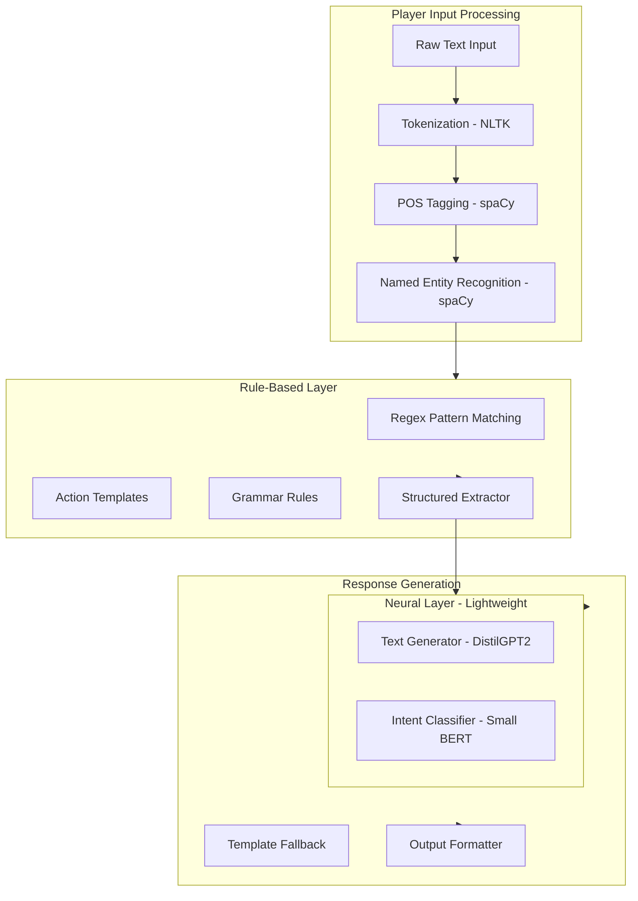

# D&D Simulator with NLP

## Project Overview

A Dungeons & Dragons simulator using Natural Language Processing to create an automated tabletop RPG experience. Features one human player alongside AI-controlled players, with an AI Dungeon Master orchestrating the adventure.

### Key Characteristics
- **Players**: 1 human player + 2-3 AI players
- **DM**: AI-powered Dungeon Master
- **Ruleset**: Simplified D&D 5e (beginner-friendly)
- **NLP Approach**: Hybrid (Rule-based + Lightweight Neural)
- **Language**: Python
- **Timeline**: 9-10 weeks (Week 3 → Week 12)
- **Hardware**: ThinkPad T480, Nvidia MX250 (2GB VRAM)
- **Future**: Streamlit web interface

---

## NLP Architecture (Hybrid Approach)

### Design Philosophy
This project uses a hybrid NLP approach combining:
1. **Rule-based parsing** for reliable structured extraction
2. **Classical NLP** (spaCy, NLTK) for entity recognition
3. **Lightweight neural models** for text generation

This approach maximizes learning opportunities while working within hardware constraints.

### Architecture Diagram



---

## Core Features

### 1. Input Processing Pipeline

#### 1.1 Tokenization & Preprocessing
```python
# Using NLTK for tokenization
from nltk.tokenize import word_tokenize, sent_tokenize
from nltk.stem import WordNetLemmatizer

class TextPreprocessor:
    def __init__(self):
        self.lemmatizer = WordNetLemmatizer()
    
    def preprocess(self, text: str) -> dict:
        return {
            'sentences': sent_tokenize(text),
            'tokens': word_tokenize(text.lower()),
            'lemmas': [self.lemmatizer.lemmatize(t) for t in tokens]
        }
```

#### 1.2 Part-of-Speech Tagging
```python
# Using spaCy for POS tagging
import spacy

nlp = spacy.load('en_core_web_sm')

def extract_pos_structure(text: str) -> dict:
    doc = nlp(text)
    return {
        'verbs': [token.text for token in doc if token.pos_ == 'VERB'],
        'nouns': [token.text for token in doc if token.pos_ == 'NOUN'],
        'adjectives': [token.text for token in doc if token.pos_ == 'ADJ'],
        'prepositions': [token.text for token in doc if token.pos_ == 'ADP']
    }
```

#### 1.3 Named Entity Recognition
```python
# Using spaCy NER
def extract_entities(text: str) -> dict:
    doc = nlp(text)
    entities = {
        'persons': [],
        'locations': [],
        'organizations': [],
        'quantities': []
    }
    for ent in doc.ents:
        if ent.label_ == 'PERSON':
            entities['persons'].append(ent.text)
        elif ent.label_ in ['GPE', 'LOC']:
            entities['locations'].append(ent.text)
        elif ent.label_ == 'QUANTITY' or ent.label_ == 'CARDINAL':
            entities['quantities'].append(ent.text)
    return entities
```

---

### 2. Rule-Based Structured Extraction

#### 2.1 Action Pattern Matching
```python
import re
from dataclasses import dataclass
from typing import Optional

@dataclass
class ParsedAction:
    action: str
    target: Optional[str] = None
    instrument: Optional[str] = None
    quantity: Optional[int] = None
    manner: Optional[str] = None
    confidence: float = 1.0

class ActionParser:
    # Define action patterns with regex
    PATTERNS = {
        'attack': [
            r'(?:i )?(?:want to |try to )?attack (?:the )?(.+?)(?:with (.+))?$',
            r'(?:i )?(?:hit|strike|slash) (?:the )?(.+?)(?:with (.+))?$',
        ],
        'cast': [
            r'(?:i )?cast (.+?)(?:on |at )(.+)?$',
            r'(?:i )?(?:use|cast) (.+?)(?:spell)?(?:on |at )(.+)?$',
        ],
        'talk': [
            r'(?:i )?(?:talk|speak|chat)(?:to|with) (?:the )?(.+)$',
            r'(?:i )?(?:ask|tell) (.+?)(?:about )?(.+)?$',
        ],
        'move': [
            r'(?:i )?(?:go|move|walk|travel) (?:to )?(.+)$',
            r'(?:i )?(?:enter|exit|leave) (?:the )?(.+)$',
        ],
        'search': [
            r'(?:i )?search (?:the )?(.+)$',
            r'(?:i )?(?:look|examine|inspect) (?:at |for )?(.+)$',
        ],
        'use': [
            r'(?:i )?use (?:the )?(.+?)(?:on |with )?(.+)?$',
            r'(?:i )?(?:drink|eat|consume) (?:the )?(.+)$',
        ],
        'give': [
            r'(?:i )?give (.+?)(?:to )?(.+)$',
        ],
    }
    
    def parse(self, text: str) -> ParsedAction:
        text = text.lower().strip()
        
        for action, patterns in self.PATTERNS.items():
            for pattern in patterns:
                match = re.match(pattern, text)
                if match:
                    groups = match.groups()
                    return ParsedAction(
                        action=action,
                        target=groups[0] if len(groups) > 0 else None,
                        instrument=groups[1] if len(groups) > 1 else None,
                        confidence=0.9
                    )
        
        # Fallback: extract verb as action
        return self._fallback_parse(text)
```

#### 2.2 Quantity Extraction
```python
class QuantityExtractor:
    NUMBER_WORDS = {
        'one': 1, 'two': 2, 'three': 3, 'four': 4, 'five': 5,
        'six': 6, 'seven': 7, 'eight': 8, 'nine': 9, 'ten': 10
    }
    
    def extract_quantities(self, text: str) -> dict:
        quantities = {}
        
        # Extract numeric quantities
        numeric_pattern = r'(\d+)\s*(gold|silver|copper|potions?|arrows?|orcs?|goblins?)'
        for match in re.finditer(numeric_pattern, text.lower()):
            quantity = int(match.group(1))
            item = match.group(2)
            quantities[item] = quantity
        
        # Extract word-based quantities
        for word, num in self.NUMBER_WORDS.items():
            pattern = rf'{word}\s*(gold|silver|copper|potions?|arrows?|orcs?|goblins?)'
            for match in re.finditer(pattern, text.lower()):
                item = match.group(1)
                quantities[item] = num
        
        return quantities
```

#### 2.3 Compound Action Detection
```python
class CompoundActionParser:
    CONNECTORS = ['then', 'and then', 'after that', 'before', 'while']
    
    def split_compound(self, text: str) -> list[str]:
        """Split compound actions into individual actions."""
        actions = [text]
        
        for connector in self.CONNECTORS:
            new_actions = []
            for action in actions:
                parts = action.split(f' {connector} ')
                new_actions.extend(parts)
            actions = new_actions
        
        return [a.strip() for a in actions if a.strip()]
```

---

### 3. Lightweight Neural Models

#### 3.1 Text Generation with DistilGPT-2
```python
from transformers import pipeline, set_seed
import torch

class NarrativeGenerator:
    def __init__(self):
        # DistilGPT-2 is small enough for CPU/MX250
        self.generator = pipeline(
            'text-generation',
            model='distilgpt2',
            device=-1  # CPU, use 0 for GPU
        )
        set_seed(42)
    
    def generate_response(self, prompt: str, max_length: int = 100) -> str:
        result = self.generator(
            prompt,
            max_length=max_length,
            num_return_sequences=1,
            temperature=0.7,
            do_sample=True
        )
        return result[0]['generated_text']
```

#### 3.2 Intent Classification with Small BERT
```python
from transformers import AutoTokenizer, AutoModelForSequenceClassification
import torch

class IntentClassifier:
    INTENTS = ['combat', 'social', 'exploration', 'meta', 'creative']
    
    def __init__(self):
        # Use a small fine-tuned model or DistilBERT
        self.tokenizer = AutoTokenizer.from_pretrained('distilbert-base-uncased')
        self.model = AutoModelForSequenceClassification.from_pretrained(
            'distilbert-base-uncased',
            num_labels=len(self.INTENTS)
        )
        # Note: Would need fine-tuning for actual use
    
    def classify(self, text: str) -> str:
        inputs = self.tokenizer(text, return_tensors='pt', truncation=True)
        with torch.no_grad():
            outputs = self.model(**inputs)
        predicted_class = torch.argmax(outputs.logits).item()
        return self.INTENTS[predicted_class]
```

---

### 4. Memory & Context Management

#### 4.1 Working Memory (Current Scene)
```python
from collections import deque
from dataclasses import dataclass
from datetime import datetime

@dataclass
class MemoryEntry:
    timestamp: datetime
    event_type: str
    content: str
    entities: list[str]
    importance: int  # 1-5

class WorkingMemory:
    def __init__(self, max_entries: int = 20):
        self.entries = deque(maxlen=max_entries)
    
    def add(self, event_type: str, content: str, entities: list = None):
        entry = MemoryEntry(
            timestamp=datetime.now(),
            event_type=event_type,
            content=content,
            entities=entities or [],
            importance=self._calculate_importance(event_type)
        )
        self.entries.append(entry)
    
    def get_context(self, max_tokens: int = 500) -> str:
        """Get recent context as formatted string."""
        context = []
        token_count = 0
        for entry in reversed(self.entries):
            if token_count >= max_tokens:
                break
            context.append(f"[{entry.event_type}] {entry.content}")
            token_count += len(entry.content.split())
        return '\n'.join(reversed(context))
```

#### 4.2 Long-Term Memory (Story Archive)
```python
class LongTermMemory:
    def __init__(self):
        self.story_summary = ""
        self.key_events = []
        self.entity_knowledge = {}  # entity_name -> facts
    
    def add_key_event(self, event: str):
        self.key_events.append(event)
        # Periodically compress old events into summary
        if len(self.key_events) > 10:
            self._compress_events()
    
    def _compress_events(self):
        """Compress old events into summary using template."""
        old_events = self.key_events[:-5]
        self.story_summary += f"\nPreviously: {'; '.join(old_events)}"
        self.key_events = self.key_events[-5:]
    
    def get_relevant_context(self, query: str) -> str:
        """Retrieve relevant context for current query."""
        # Simple keyword matching for relevance
        relevant = []
        query_words = set(query.lower().split())
        for event in self.key_events:
            event_words = set(event.lower().split())
            if query_words & event_words:  # Intersection
                relevant.append(event)
        return '\n'.join(relevant)
```

---

### 5. AI Dungeon Master Engine

#### 5.1 Response Generation Pipeline
```python
class DMEngine:
    def __init__(self):
        self.preprocessor = TextPreprocessor()
        self.action_parser = ActionParser()
        self.quantity_extractor = QuantityExtractor()
        self.intent_classifier = IntentClassifier()
        self.narrative_generator = NarrativeGenerator()
        self.memory = WorkingMemory()
        self.long_term_memory = LongTermMemory()
    
    def process_player_input(self, text: str) -> dict:
        # Step 1: Preprocess
        preprocessed = self.preprocessor.preprocess(text)
        
        # Step 2: Extract entities
        entities = extract_entities(text)
        
        # Step 3: Parse action
        parsed_action = self.action_parser.parse(text)
        
        # Step 4: Extract quantities
        quantities = self.quantity_extractor.extract_quantities(text)
        
        # Step 5: Classify intent
        intent = self.intent_classifier.classify(text)
        
        return {
            'preprocessed': preprocessed,
            'entities': entities,
            'action': parsed_action,
            'quantities': quantities,
            'intent': intent
        }
    
    def generate_response(self, parsed_input: dict) -> str:
        # Build prompt from context
        context = self.memory.get_context()
        story_context = self.long_term_memory.story_summary
        
        # Use template for common actions, neural for creative
        if parsed_input['action'].confidence > 0.8:
            response = self._template_response(parsed_input)
        else:
            prompt = self._build_prompt(parsed_input, context)
            response = self.narrative_generator.generate_response(prompt)
        
        # Store in memory
        self.memory.add('player_action', parsed_input['action'].action)
        self.memory.add('dm_response', response)
        
        return response
```

#### 5.2 Template-Based Responses
```python
class ResponseTemplates:
    TEMPLATES = {
        'attack_success': [
            "Your {weapon} strikes true! The {target} takes {damage} damage.",
            "A solid hit! You deal {damage} damage to the {target}.",
            "Your attack connects, dealing {damage} damage."
        ],
        'attack_miss': [
            "Your attack misses the {target}.",
            "The {target} dodges your strike!",
            "You swing but fail to connect."
        ],
        'cast_spell': [
            "You cast {spell}! {effect}",
            "Magic energy surges as you unleash {spell}. {effect}"
        ],
        'move': [
            "You make your way to {location}.",
            "You travel to {location}, taking in your surroundings."
        ],
        'talk': [
            "You approach {target}. They turn to face you.",
            '"Greetings," you say to {target}.'
        ]
    }
    
    def get_template(self, action_type: str, outcome: str) -> str:
        import random
        templates = self.TEMPLATES.get(f'{action_type}_{outcome}', 
                                        self.TEMPLATES.get(action_type, ["{action}"]))
        return random.choice(templates)
```

---

### 6. AI Player Companions

#### 6.1 AI Player Decision Making
```python
class AIPlayer:
    def __init__(self, character: Character):
        self.character = character
        self.personality_traits = character.personality.split(',')
    
    def decide_action(self, situation: dict) -> str:
        """Decide what action to take based on situation."""
        # Rule-based decision tree
        if situation['in_combat']:
            return self._combat_decision(situation)
        else:
            return self._exploration_decision(situation)
    
    def _combat_decision(self, situation: dict) -> str:
        # Priority: Heal if low HP > Attack weakest enemy > Support allies
        if self.character.hp < self.character.max_hp * 0.3:
            return "I need to heal! Using a potion."
        
        if situation.get('enemies'):
            weakest = min(situation['enemies'], key=lambda e: e.hp)
            return f"I attack the {weakest.name}!"
        
        return "I'll defend and assess the situation."
    
    def _exploration_decision(self, situation: dict) -> str:
        # Personality-driven exploration
        if 'curious' in self.personality_traits:
            return "I want to investigate that further."
        elif 'cautious' in self.personality_traits:
            return "We should be careful here."
        else:
            return "What do you think we should do?"
```

---

### 7. Simplified Rules Engine

#### 7.1 Dice Rolling
```python
import random
from dataclasses import dataclass

@dataclass
class DiceResult:
    rolls: list[int]
    total: int
    modifier: int
    final: int
    critical: bool = False

class DiceRoller:
    @staticmethod
    def roll(notation: str) -> DiceResult:
        """Roll dice using D&D notation (e.g., '2d6+3')."""
        # Parse notation
        match = re.match(r'(\d+)d(\d+)([+-]\d+)?', notation)
        if not match:
            raise ValueError(f"Invalid dice notation: {notation}")
        
        num_dice = int(match.group(1))
        die_size = int(match.group(2))
        modifier = int(match.group(3)) if match.group(3) else 0
        
        # Roll dice
        rolls = [random.randint(1, die_size) for _ in range(num_dice)]
        total = sum(rolls)
        final = total + modifier
        
        # Check for critical (d20, natural 20)
        critical = die_size == 20 and num_dice == 1 and rolls[0] == 20
        
        return DiceResult(
            rolls=rolls,
            total=total,
            modifier=modifier,
            final=final,
            critical=critical
        )
```

#### 7.2 Combat Resolution
```python
class CombatResolver:
    def resolve_attack(self, attacker: Character, target: Character, weapon: str) -> dict:
        # Roll attack
        attack_roll = DiceRoller.roll('1d20')
        attack_bonus = attacker.get_attack_bonus()
        total_attack = attack_roll.final + attack_bonus
        
        # Check hit
        hit = total_attack >= target.armor_class
        
        if hit:
            # Roll damage
            damage_dice = self._get_weapon_damage(weapon)
            damage_roll = DiceRoller.roll(damage_dice)
            
            if attack_roll.critical:
                damage_roll.final *= 2  # Double damage on crit
            
            return {
                'hit': True,
                'critical': attack_roll.critical,
                'damage': damage_roll.final,
                'attack_roll': total_attack
            }
        
        return {
            'hit': False,
            'critical': False,
            'damage': 0,
            'attack_roll': total_attack
        }
```

---

## Project Structure

```
dnd-simulator/
├── src/
│   ├── nlp/
│   │   ├── __init__.py
│   │   ├── preprocessor.py       # NLTK tokenization
│   │   ├── pos_tagger.py         # spaCy POS tagging
│   │   ├── ner_extractor.py      # spaCy NER
│   │   ├── action_parser.py      # Regex action parsing
│   │   ├── quantity_extractor.py # Number extraction
│   │   ├── intent_classifier.py  # DistilBERT classifier
│   │   └── generator.py          # DistilGPT-2 generation
│   ├── core/
│   │   ├── __init__.py
│   │   ├── dm_engine.py          # DM orchestration
│   │   ├── ai_player.py          # AI player logic
│   │   ├── combat.py             # Combat system
│   │   └── rules.py              # Dice & rules
│   ├── memory/
│   │   ├── __init__.py
│   │   ├── working_memory.py     # Short-term context
│   │   └── long_term_memory.py   # Story archive
│   ├── models/
│   │   ├── __init__.py
│   │   ├── character.py          # Character model
│   │   ├── game_state.py         # Game state
│   │   └── parsed_input.py       # NLP output model
│   ├── data/
│   │   ├── monsters.json         # Monster stats
│   │   ├── spells.json           # Spell data
│   │   └── templates.json        # Response templates
│   └── utils/
│       ├── __init__.py
│       ├── dice.py               # Dice utilities
│       └── display.py            # CLI formatting
├── tests/
│   ├── test_parser.py
│   ├── test_combat.py
│   └── test_memory.py
├── saves/                        # Game saves
├── main.py                       # Entry point
├── config.yaml                   # Configuration
└── requirements.txt
```

---

## Data Models

### Character Model
```python
@dataclass
class Character:
    name: str
    race: str
    character_class: str
    level: int = 1
    
    # Abilities
    strength: int = 10
    dexterity: int = 10
    constitution: int = 10
    intelligence: int = 10
    wisdom: int = 10
    charisma: int = 10
    
    # Combat
    hp: int = 10
    max_hp: int = 10
    armor_class: int = 10
    
    # AI Player fields
    personality: str = ""
    is_ai: bool = False
    
    def get_modifier(self, ability: str) -> int:
        """Calculate ability modifier."""
        score = getattr(self, ability)
        return (score - 10) // 2
    
    def get_attack_bonus(self) -> int:
        """Get attack bonus (proficiency + strength/dex)."""
        proficiency = 2  # Level 1-4
        if self.character_class in ['Fighter', 'Ranger', 'Paladin']:
            return proficiency + self.get_modifier('strength')
        else:
            return proficiency + self.get_modifier('dexterity')
```

### Game State Model
```python
@dataclass
class GameState:
    session_id: str
    
    # Party
    human_player: Character
    ai_players: list[Character]
    
    # Current situation
    location: str
    scene_description: str
    
    # Combat state
    in_combat: bool = False
    enemies: list = None
    turn_order: list = None
    current_turn: int = 0
    
    # Memory references
    working_memory: WorkingMemory = None
    long_term_memory: LongTermMemory = None
```

---

## Development Timeline

### Week 3-4: Foundation & Basic NLP
- [ ] Project setup and structure
- [ ] Character and game state models
- [ ] NLTK tokenization and preprocessing
- [ ] spaCy POS tagging and NER
- [ ] Basic CLI interface
- [ ] Dice rolling utilities

### Week 5-6: Rule-Based NLP
- [ ] Regex action pattern matching
- [ ] Quantity extraction
- [ ] Compound action parsing
- [ ] Response templates
- [ ] Working memory implementation

### Week 7-8: Neural Models & Integration
- [ ] Set up DistilGPT-2 for generation
- [ ] Implement intent classifier
- [ ] Long-term memory system
- [ ] DM engine integration
- [ ] AI player decision making

### Week 9-10: Game Systems
- [ ] Combat system
- [ ] Encounter handling
- [ ] Save/Load functionality
- [ ] End-to-end testing

### Week 11-12: Polish & Delivery
- [ ] Bug fixes and optimization
- [ ] Documentation
- [ ] Demo preparation
- [ ] Buffer for issues

---

## Hardware Considerations

### MX250 GPU (2GB VRAM) Constraints
| Component | CPU | GPU | Notes |
|-----------|-----|-----|-------|
| spaCy NER | ✅ | - | Runs on CPU |
| DistilGPT-2 | ✅ | ⚠️ | CPU preferred, GPU optional |
| DistilBERT | ✅ | ⚠️ | Small batches only |
| Rule-based | ✅ | - | No GPU needed |

### Optimization Strategies
1. **CPU-first design**: Most NLP runs on CPU
2. **Small batch sizes**: Process one input at a time
3. **Model quantization**: Use quantized models if needed
4. **Caching**: Cache model outputs for repeated patterns
5. **Lazy loading**: Load models only when needed

---

## Dependencies

```
# requirements.txt
# Core
python>=3.8
pyyaml>=6.0

# NLP - Classical
nltk>=3.8
spacy>=3.5
en_core_web_sm  # spaCy model

# NLP - Neural (lightweight)
torch>=2.0
transformers>=4.30

# Utilities
pydantic>=2.0
rich>=13.0      # CLI formatting
```

---

## Success Criteria

### Must Achieve
1. ✅ Parse player input using rule-based + NLP techniques
2. ✅ Extract structured data (actions, targets, quantities)
3. ✅ Maintain conversation context across session
4. ✅ Generate coherent DM responses
5. ✅ AI players make reasonable decisions
6. ✅ Basic combat works correctly
7. ✅ Run on ThinkPad T480 with MX250

### Learning Outcomes
1. Understand tokenization and text preprocessing
2. Learn POS tagging and NER with spaCy
3. Master regex pattern matching for NLP
4. Work with transformer models (DistilBERT, GPT-2)
5. Implement memory systems for context
6. Build end-to-end NLP pipeline

---

## Quick Start Example

```
=== D&D Simulator ===

[DM]: You stand at the entrance of a dark cave. 
The air smells of damp earth and something... else.
Your companions, Elara the Wizard and Thorne the Fighter, 
wait for your decision.

What do you do?
> I light a torch and enter the cave carefully

[Parser] Detected: action=move, manner=carefully, items=[torch]
[DM]: You strike your flint and light a torch. The flame 
flickers to life, casting dancing shadows on the cave walls.
You proceed carefully into the darkness...

[Elara]: I'll cast Light on my staff as well. Better safe than sorry!

[DM]: The cave opens into a larger chamber. You see...
```
